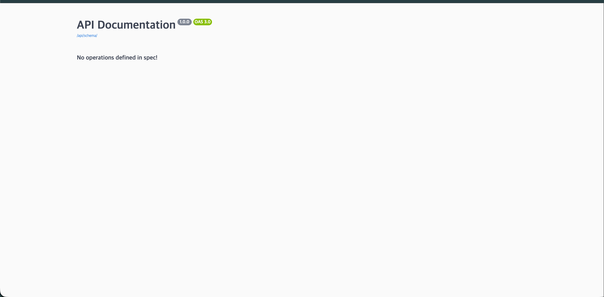

# Django Project Template

Django REST Framework + PostgreSQL + Docker 기반 프로젝트 템플릿입니다.  
여러분들의 구조를 적용시켜서 꼭!!! 변경해서 사용해주세요.

## Swagger (API 문서)

http://3.34.209.84:8000/api/docs/


위와 같이 뜨면 자동 배포 성공
main 브랜치에 코드가 머지되면 서버에 자동 배포되어 Swagger가 업데이트됩니다.  
협업 하시려면 자동배포가 적용되어 스웨거가 바로 확인 가능하고 훨씬 편하겠죠?

---

## 프로젝트 구조

```
project_templete/
├── .github/workflows/     # CI/CD 파이프라인
│   ├── ci.yml             # PR 시 lint + test
│   └── deploy.yml         # main 머지 시 서버 배포
├── apps/                  # Django 앱 폴더
├── config/                # Django 설정 (settings, urls, wsgi)
├── envs/                  # 환경변수 파일
│   ├── .env.example       # 개발용 환경변수 템플릿
│   └── .env.prod.example  # 프로덕션용 환경변수 템플릿
├── resource/              # Docker 관련 파일
│   ├── Dockerfile
│   ├── docker-compose.yml      # 개발용
│   └── docker-compose.prod.yml # 프로덕션용
├── Makefile               # Docker 명령어 모음
└── pyproject.toml         # Python 의존성 + 린트 설정
```

---

## 시작하기

### 1. 레포지토리 복제

```bash
git clone https://github.com/2joonkim/project_templete.git
cd project_templete
```

### 2. 환경변수 파일 생성

```bash
cp envs/.env.example envs/.env
```

`envs/.env` 파일을 열어서 본인 프로젝트에 맞게 수정합니다:

```env
SECRET_KEY=본인만의-시크릿-키
DEBUG=True

POSTGRES_DB=본인_db명
POSTGRES_USER=postgres
POSTGRES_PASSWORD=본인_비밀번호
POSTGRES_HOST=db
POSTGRES_PORT=5432
```

### 3. Docker 빌드 & 실행

```bash
make build
make up
```

### 4. 마이그레이션

```bash
make migrate
```

### 5. 접속 확인

- Django: http://localhost:8000
- Swagger (로컬): http://localhost:8000/api/docs/

---

## 수정해야 할 파일

본인 프로젝트로 사용하려면 아래 항목을 수정하세요.

### 필수

| 파일 | 수정 내용 |
|------|-----------|
| `envs/.env` | `.env.example` 복사 후 DB명, 비밀번호 등 본인 값으로 변경 |
| `config/settings.py` | `INSTALLED_APPS`에 본인이 만든 앱 등록 |
| `config/settings.py` | `SPECTACULAR_SETTINGS` > `TITLE`을 본인 프로젝트명으로 변경 |

### 선택

| 파일 | 수정 내용 |
|------|-----------|
| `resource/docker-compose.yml` | `container_name`을 본인 프로젝트명으로 변경 (여러 프로젝트 동시 실행 시 충돌 방지) |
| `pyproject.toml` | `name`, `description` 본인 프로젝트에 맞게 변경 |

---

## Makefile 명령어

```bash
make               # 명령어 목록 보기
make build          # Docker 이미지 빌드
make up             # 컨테이너 실행
make down           # 컨테이너 중지
make restart        # 재시작
make logs           # 로그 실시간 확인
make ps             # 컨테이너 상태 확인
make migrate        # 마이그레이션 실행
make makemigrations # 마이그레이션 파일 생성
make createsuperuser # 관리자 계정 생성
make shell          # Django shell
make lint           # 코드 검사 (ruff)
make code_format    # 코드 자동 포맷팅 (ruff)
make test           # mypy 타입체크 + Django 테스트
make db-shell       # PostgreSQL 직접 접속
make prune          # Docker 정리
```

---

## Git 브랜치 전략 & 개발 플로우

기존 Git Flow를 간소화시켰습니다.  
`feature` → `develop` → `main` 3단계로 운영합니다.

```
feature/기능명  →  develop  →  main (자동배포)
```

### 개발 순서

```bash
# 1. develop 브랜치에서 기능 브랜치 생성
git checkout develop
git checkout -b feature/기능명

# 2. 개발 진행 & 커밋
git add -A
git commit -m "feat: 기능 설명"

# 3. 푸시
git push origin feature/기능명

# 4. GitHub에서 feature/기능명 → develop 으로 PR 생성
#    → CI 자동 실행 (ruff + mypy + test)
#    → 통과하면 코드 리뷰 후 머지

# 5. 배포할 준비가 되면 GitHub에서 develop → main 으로 PR 생성
#    → 머지하면 서버 자동 배포
```

### 코드 포맷팅 (PR 전에 실행)

```bash
# 컨테이너가 떠있을 때
make code_format

# 로컬에서 직접
uv run ruff check --fix .
uv run ruff format .
```

---

## CI/CD 파이프라인

### PR → develop (ci.yml)

- Ruff (린트 + 포맷팅 검사)
- Mypy (타입 체크)
- Django 테스트

### develop → main 머지 시 (deploy.yml)

- Docker 이미지 빌드 → GHCR 푸시 → 서버 자동 배포 (Swagger 포함)

---

## 배포 서버 설정 (처음 한 번만)

서버에 Docker가 설치되어 있어야 합니다.

```bash
# Docker 설치
curl -fsSL https://get.docker.com | sh

# 앱 디렉토리 + 환경변수 생성
mkdir -p ~/app/resource ~/app/envs
nano ~/app/envs/.env
```

GitHub 레포 > Settings > Secrets에 아래 값 등록:

| Secret | 값 |
|--------|-----|
| `SERVER_HOST` | 서버 IP |
| `SERVER_USER` | SSH 유저명 (예: ubuntu) |
| `SERVER_SSH_KEY` | SSH 프라이빗 키 전문 |
| `GHCR_TOKEN` | GitHub Personal Access Token (read:packages 권한) |

---

## 기술 스택

- Python 3.13
- Django 6.0
- Django REST Framework
- PostgreSQL 17
- Docker / Docker Compose
- GitHub Actions (CI/CD)
- drf-spectacular (Swagger)
- gunicorn (프로덕션 WSGI)
- ruff (린트 + 포맷팅)
- mypy (타입 체크)

## 커밋 템플릿

```
feat     : 기능 추가
fix      : 버그 수정
refactor : 리팩토링 (기능 변화 없음)
docs     : 문서 수정
style    : 포맷팅 (black, isort 등)
test     : 테스트 코드
chore    : 기타 설정 (ci, docker, env 등)
```

## PR 리뷰 규칙

- 본인 PR은 본인이 리뷰/머지할 수 없다
- 최소 2명 이상의 리뷰(Approve)가 필요하다
- 리뷰(Approve) 없이는 머지할 수 없다
- CI 또는 테스트가 통과해야 한다
- 브랜치 충돌이 없어야 한다